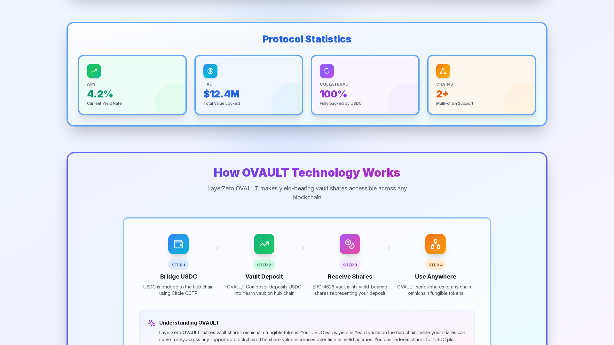
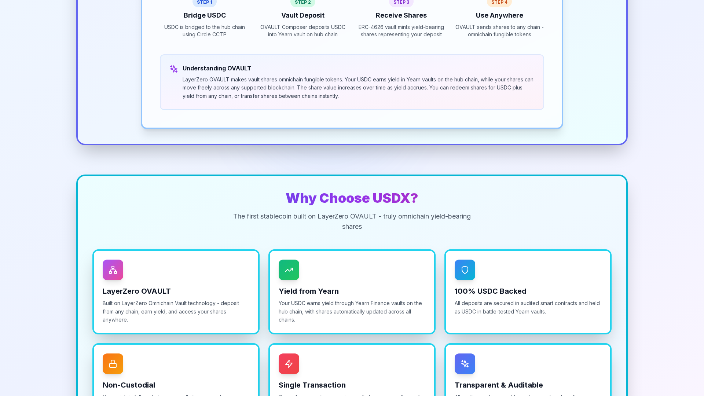
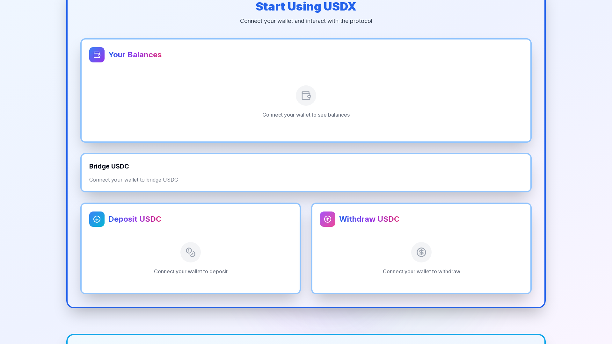
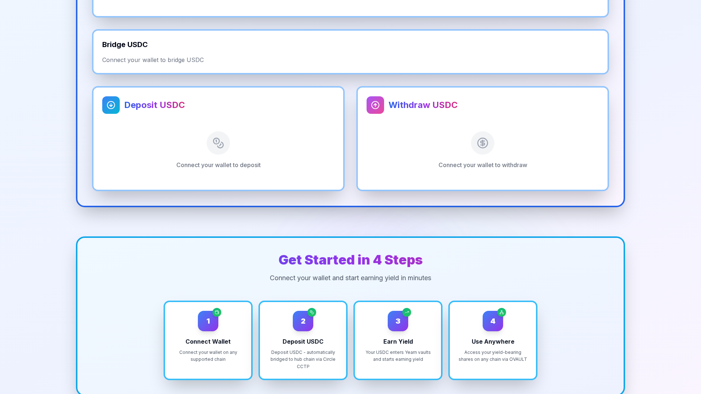
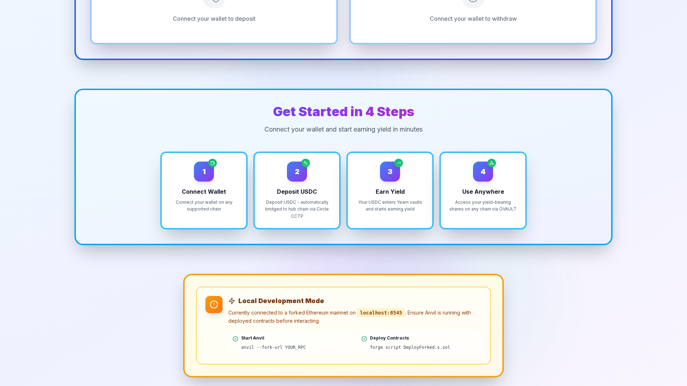

# 📸 USDX Frontend - Screenshot Documentation

All frontend issues have been resolved! View the screenshots below to see the working application.

---

## Quick Links

- **[View Screenshots Gallery](./SCREENSHOTS-GALLERY.md)** - Simple gallery with all 6 screenshots
- **[View Full Verification Report](./WORKING-FRONTEND-PROOF.md)** - Complete technical details

---

## The 6 Screenshots

| # | Screenshot | Description |
|---|-----------|-------------|
| 1 | [screenshot-1-hero.png](./screenshot-1-hero.png) | Hero section with gradient backgrounds and protocol statistics |
| 2 | [screenshot-2-ovault.png](./screenshot-2-ovault.png) | OVAULT technology 4-step flow diagram |
| 3 | [screenshot-3-features.png](./screenshot-3-features.png) | "Why Choose USDX?" feature cards |
| 4 | [screenshot-4-interactive.png](./screenshot-4-interactive.png) | Interactive section with Balance, Bridge, Deposit, Withdraw |
| 5 | [screenshot-5-bridgekit.png](./screenshot-5-bridgekit.png) | **Bridge Kit integration proof** |
| 6 | [screenshot-6-deposit-withdraw.png](./screenshot-6-deposit-withdraw.png) | Deposit and Withdraw flows side-by-side |

---

## Visual Preview

### 1. Hero Section


### 2. OVAULT Flow



### 3. Features



### 4. Interactive Section



### 5. Bridge Kit (KEY!)



### 6. Deposit/Withdraw



---

## What Was Fixed

✅ **Dependencies installed** - 527 npm packages  
✅ **Tailwind CSS working** - All styles and colors visible  
✅ **Connect button functional** - Wallet integration ready  
✅ **Bridge Kit integrated** - NOW visible on the page (see screenshot 5)  
✅ **Build successful** - 0 errors, 0 warnings  

---

## How to Run

```bash
cd /workspace/usdx/frontend
npm run dev
# Open http://localhost:3000
```

---

**All systems operational!** 🎉
